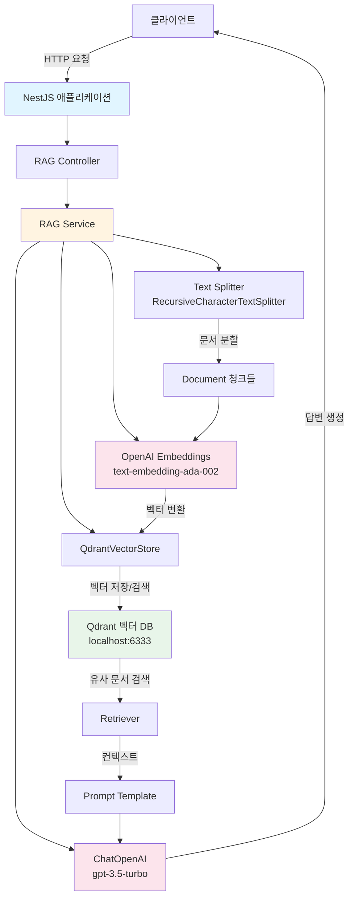
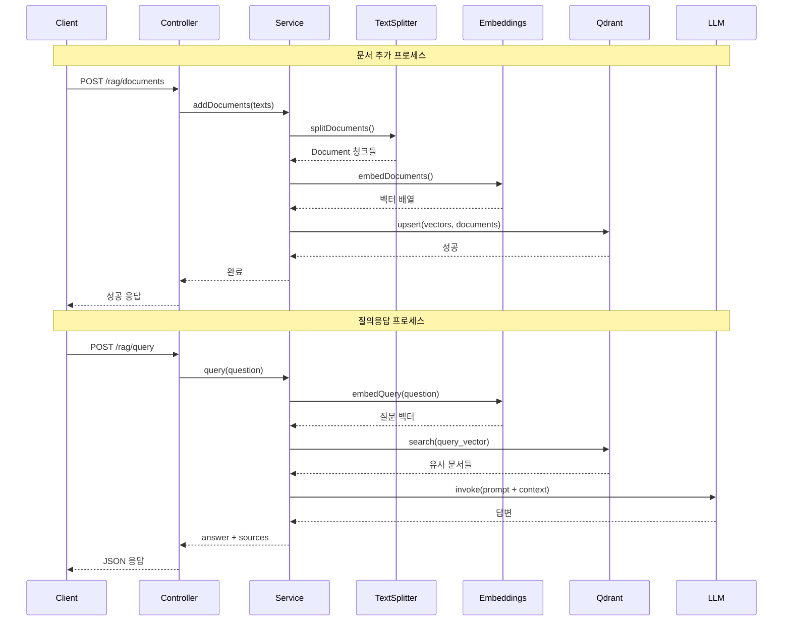

<p align="center">
  <a href="http://nestjs.com/" target="blank"></a>
</p>

[circleci-image]: https://img.shields.io/circleci/build/github/nestjs/nest/master?token=abc123def456
[circleci-url]: https://circleci.com/gh/nestjs/nest

  <p align="center">A progressive <a href="http://nodejs.org" target="_blank">Node.js</a> framework for building efficient and scalable server-side applications.</p>
    <p align="center">
<a href="https://www.npmjs.com/~nestjscore" target="_blank"></a>
<a href="https://www.npmjs.com/~nestjscore" target="_blank"></a>
<a href="https://www.npmjs.com/~nestjscore" target="_blank"></a>
<a href="https://circleci.com/gh/nestjs/nest" target="_blank"></a>
<a href="https://discord.gg/G7Qnnhy" target="_blank"></a>
<a href="https://opencollective.com/nest#backer" target="_blank"></a>
<a href="https://opencollective.com/nest#sponsor" target="_blank"></a>
  <a href="https://paypal.me/kamilmysliwiec" target="_blank"></a>
    <a href="https://opencollective.com/nest#sponsor"  target="_blank"></a>
  <a href="https://twitter.com/nestframework" target="_blank"></a>
</p>
  <!--[](https://opencollective.com/nest#backer)
  [](https://opencollective.com/nest#sponsor)-->

## Description

LangChain을 활용한 RAG(Retrieval-Augmented Generation) 시스템을 구축한 NestJS 프로젝트입니다.

## 아키텍처

### 시스템 아키텍처 다이어그램



### RAG 워크플로우



자세한 아키텍처 문서는 [docs/ARCHITECTURE.md](./docs/ARCHITECTURE.md)를 참고하세요.

## 문서

- [아키텍처 문서](./docs/ARCHITECTURE.md) - 시스템 아키텍처 및 설계 상세 설명
- [API 문서](./docs/API.md) - REST API 엔드포인트 상세 가이드
- [컴포넌트 문서](./docs/COMPONENTS.md) - 각 컴포넌트의 상세 설명 및 코드 예제

## RAG 시스템 사용 가이드

### 1. Qdrant 서버 실행

Qdrant는 벡터 데이터베이스 서버입니다. Docker를 사용하여 실행할 수 있습니다:

```bash
docker run -p 6333:6333 -p 6334:6334 qdrant/qdrant
```

또는 Qdrant Cloud를 사용할 수 있습니다.

### 2. 환경 변수 설정

프로젝트 루트에 `.env` 파일을 생성하고 필요한 환경 변수를 설정하세요:

```env
# OpenAI API 키 (필수)
OPENAI_API_KEY=your_openai_api_key_here

# Qdrant 설정 (선택, 기본값: http://localhost:6333)
QDRANT_URL=http://localhost:6333
QDRANT_API_KEY=your_qdrant_api_key_here  # Qdrant Cloud 사용 시 필요
QDRANT_COLLECTION_NAME=rag-documents      # 컬렉션 이름 (기본값: rag-documents)

# 서버 포트 (선택, 기본값: 3000)
PORT=3000
```

### 3. 문서 추가

#### 방법 1: 텍스트 배열로 추가

```bash
POST http://localhost:3000/rag/documents
Content-Type: application/json

{
  "texts": [
    "문서 내용 1",
    "문서 내용 2"
  ]
}
```

#### 방법 2: 파일 업로드

```bash
POST http://localhost:3000/rag/upload
Content-Type: multipart/form-data

file: [파일 선택]
```

### 4. 질문하기

```bash
POST http://localhost:3000/rag/query
Content-Type: application/json

{
  "question": "질문 내용"
}
```

### 5. 유사 문서 검색

```bash
GET http://localhost:3000/rag/search?q=검색어&k=4
```

### 주요 기능

- **문서 로딩**: 텍스트 문서를 벡터 스토어에 추가
- **텍스트 분할**: 문서를 적절한 크기의 청크로 분할
- **벡터 임베딩**: OpenAI 임베딩 모델을 사용하여 텍스트를 벡터로 변환
- **벡터 검색**: Qdrant를 사용한 유사 문서 검색
- **RAG 체인**: 검색된 문서를 컨텍스트로 사용하여 LLM이 답변 생성

### 벡터 데이터베이스: Qdrant

이 프로젝트는 Qdrant를 벡터 데이터베이스로 사용합니다:

- **로컬 실행**: Docker를 사용하여 로컬에서 실행 가능
- **클라우드**: Qdrant Cloud를 사용하여 관리형 서비스 이용 가능
- **확장성**: 대규모 벡터 데이터 처리에 최적화
- **성능**: 빠른 유사도 검색 및 실시간 업데이트 지원

## Project setup

```bash
$ pnpm install
```

## Compile and run the project

```bash
# development
$ pnpm run start

# watch mode
$ pnpm run start:dev

# production mode
$ pnpm run start:prod
```

## Run tests

```bash
# unit tests
$ pnpm run test

# e2e tests
$ pnpm run test:e2e

# test coverage
$ pnpm run test:cov
```

## Deployment

When you're ready to deploy your NestJS application to production, there are some key steps you can take to ensure it runs as efficiently as possible. Check out the [deployment documentation](https://docs.nestjs.com/deployment) for more information.

If you are looking for a cloud-based platform to deploy your NestJS application, check out [Mau](https://mau.nestjs.com), our official platform for deploying NestJS applications on AWS. Mau makes deployment straightforward and fast, requiring just a few simple steps:

```bash
$ pnpm install -g @nestjs/mau
$ mau deploy
```

With Mau, you can deploy your application in just a few clicks, allowing you to focus on building features rather than managing infrastructure.

## Resources

Check out a few resources that may come in handy when working with NestJS:

- Visit the [NestJS Documentation](https://docs.nestjs.com) to learn more about the framework.
- For questions and support, please visit our [Discord channel](https://discord.gg/G7Qnnhy).
- To dive deeper and get more hands-on experience, check out our official video [courses](https://courses.nestjs.com/).
- Deploy your application to AWS with the help of [NestJS Mau](https://mau.nestjs.com) in just a few clicks.
- Visualize your application graph and interact with the NestJS application in real-time using [NestJS Devtools](https://devtools.nestjs.com).
- Need help with your project (part-time to full-time)? Check out our official [enterprise support](https://enterprise.nestjs.com).
- To stay in the loop and get updates, follow us on [X](https://x.com/nestframework) and [LinkedIn](https://linkedin.com/company/nestjs).
- Looking for a job, or have a job to offer? Check out our official [Jobs board](https://jobs.nestjs.com).

## Support

Nest is an MIT-licensed open source project. It can grow thanks to the sponsors and support by the amazing backers. If you'd like to join them, please [read more here](https://docs.nestjs.com/support).

## Stay in touch

- Author - [Kamil Myśliwiec](https://twitter.com/kammysliwiec)
- Website - [https://nestjs.com](https://nestjs.com/)
- Twitter - [@nestframework](https://twitter.com/nestframework)

## License

Nest is [MIT licensed](https://github.com/nestjs/nest/blob/master/LICENSE).
