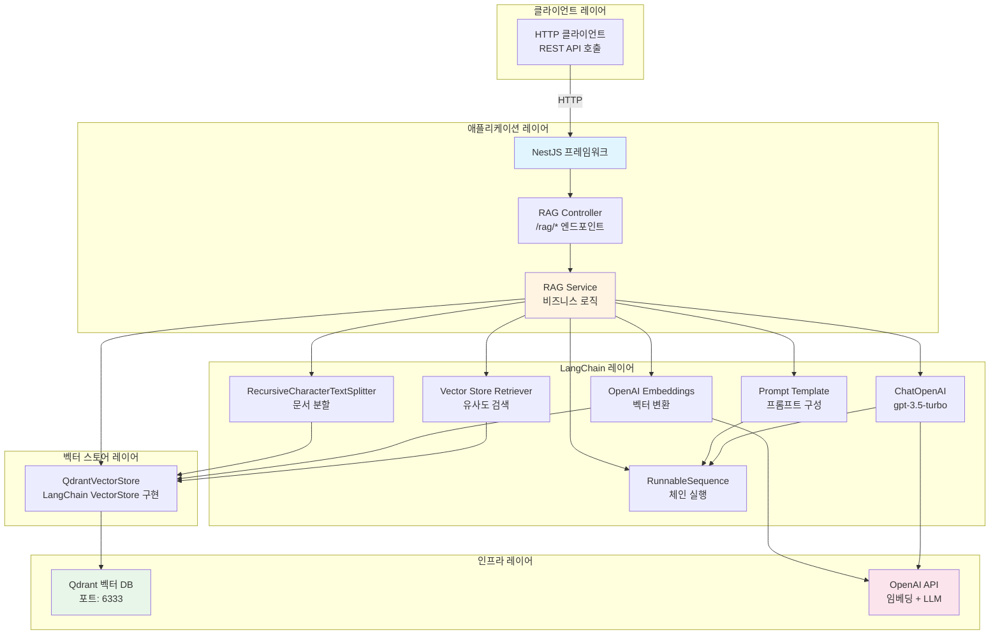
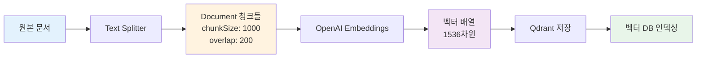
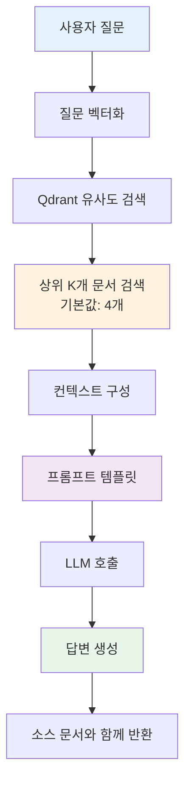

# RAG 시스템 아키텍처

## 목차

1. [개요](#개요)
2. [시스템 구성 요소](#시스템-구성-요소)
3. [데이터 흐름](#데이터-흐름)
4. [주요 컴포넌트 상세](#주요-컴포넌트-상세)
5. [기술 스택](#기술-스택)
6. [확장성 고려사항](#확장성-고려사항)

## 개요

이 프로젝트는 **RAG (Retrieval-Augmented Generation)** 패턴을 구현한 NestJS 기반 웹 애플리케이션입니다. RAG는 대규모 언어 모델(LLM)의 지식 한계를 보완하기 위해 외부 지식 베이스에서 관련 정보를 검색하여 컨텍스트로 제공하는 기법입니다.

### RAG의 핵심 개념

1. **Retrieval (검색)**: 사용자 질문과 관련된 문서를 벡터 데이터베이스에서 검색
2. **Augmentation (증강)**: 검색된 문서를 프롬프트에 포함하여 컨텍스트 제공
3. **Generation (생성)**: LLM이 컨텍스트를 바탕으로 정확한 답변 생성

## 시스템 구성 요소

### 전체 아키텍처



## 데이터 흐름

### 1. 문서 추가 프로세스



**단계별 설명:**

1. **문서 입력**: 텍스트 배열 또는 파일 업로드
2. **텍스트 분할**: `RecursiveCharacterTextSplitter`를 사용하여 문서를 1000자 청크로 분할 (200자 오버랩)
3. **벡터 임베딩**: OpenAI의 `text-embedding-ada-002` 모델로 각 청크를 1536차원 벡터로 변환
4. **벡터 저장**: Qdrant에 벡터와 메타데이터 저장
5. **인덱싱**: Qdrant가 자동으로 벡터 인덱스 생성 (Cosine Similarity)

### 2. 질의응답 프로세스



**단계별 설명:**

1. **질문 벡터화**: 사용자 질문을 동일한 임베딩 모델로 벡터 변환
2. **유사도 검색**: Qdrant에서 Cosine Similarity를 사용하여 가장 유사한 K개 문서 검색
3. **컨텍스트 구성**: 검색된 문서들의 텍스트를 결합
4. **프롬프트 구성**: 컨텍스트와 질문을 포함한 프롬프트 생성
5. **LLM 호출**: GPT-3.5-turbo 모델로 답변 생성
6. **결과 반환**: 답변과 함께 참조된 소스 문서 반환

## 주요 컴포넌트 상세

### 1. RAG Controller (`rag.controller.ts`)

**역할**: HTTP 요청을 받아 서비스로 전달하는 API 엔드포인트

**주요 엔드포인트:**

- `POST /rag/documents`: 텍스트 배열로 문서 추가
- `POST /rag/upload`: 파일 업로드로 문서 추가
- `POST /rag/query`: 질문에 대한 답변 생성
- `GET /rag/search`: 유사 문서 검색

### 2. RAG Service (`rag.service.ts`)

**역할**: RAG 시스템의 핵심 비즈니스 로직 처리

**주요 메서드:**

```typescript
// 문서 추가
addDocuments(texts: string[]): Promise<void>

// 파일에서 문서 로드
loadDocumentFromFile(filePath: string): Promise<void>

// 질의응답
query(question: string): Promise<{answer: string, sourceDocuments?: Document[]}>

// 유사도 검색
similaritySearch(query: string, k: number): Promise<Document[]>
```

**초기화 프로세스:**

1. `OnModuleInit`에서 벡터 스토어 초기화
2. OpenAI Embeddings 및 ChatOpenAI 인스턴스 생성
3. Qdrant 연결 확인

### 3. QdrantVectorStore (`qdrant-vector-store.ts`)

**역할**: LangChain의 `VectorStore` 인터페이스를 구현하여 Qdrant와 통합

**주요 기능:**

- `addDocuments()`: 문서를 벡터로 변환하여 Qdrant에 저장
- `similaritySearch()`: 유사도 기반 문서 검색
- `similaritySearchWithScore()`: 점수와 함께 검색 결과 반환
- `ensureCollection()`: 컬렉션이 없으면 자동 생성

**구현 특징:**

- LangChain의 `VectorStore` 추상 클래스 확장
- Qdrant 클라이언트를 사용한 벡터 저장/검색
- 자동 컬렉션 생성 및 관리
- Cosine Similarity 거리 측정 방식 사용

### 4. 텍스트 분할 전략

**RecursiveCharacterTextSplitter 설정:**

- `chunkSize`: 1000자
- `chunkOverlap`: 200자

**분할 전략:**

1. 먼저 문단 단위로 분할 시도
2. 문단이 너무 크면 문장 단위로 분할
3. 문장도 너무 크면 단어 단위로 분할
4. 최종적으로 문자 단위로 분할

**오버랩의 중요성:**

- 문맥 유지를 위해 청크 간 200자 오버랩
- 경계에서 중요한 정보가 잘리지 않도록 보장

### 5. 프롬프트 템플릿

**기본 프롬프트 구조:**

```
다음 컨텍스트를 사용하여 질문에 답변해주세요. 컨텍스트에 답이 없으면 모른다고 답변하세요.

컨텍스트:
{context}

질문: {question}

답변:
```

**특징:**

- 컨텍스트 기반 답변 강제
- 컨텍스트에 없는 정보에 대한 명시적 처리
- 한국어 프롬프트 사용

## 기술 스택

### 프레임워크 및 라이브러리

| 카테고리 | 기술 | 버전 | 용도 |
|---------|------|------|------|
| **프레임워크** | NestJS | ^11.0.1 | 백엔드 프레임워크 |
| **RAG 라이브러리** | LangChain | ^1.2.0 | RAG 파이프라인 구축 |
| **임베딩** | @langchain/openai | ^1.2.0 | OpenAI 임베딩 모델 |
| **텍스트 분할** | @langchain/textsplitters | ^1.0.1 | 문서 분할 |
| **벡터 DB** | @qdrant/qdrant-js | ^1.16.2 | Qdrant 클라이언트 |
| **파일 처리** | multer | ^2.0.2 | 파일 업로드 |
| **PDF 파싱** | pdf-parse | ^2.4.5 | PDF 파일 처리 |

### 외부 서비스

- **OpenAI API**: 
  - `text-embedding-ada-002`: 텍스트 임베딩 (1536차원)
  - `gpt-3.5-turbo`: 대화형 LLM

- **Qdrant**: 
  - 벡터 데이터베이스 서버
  - 로컬 실행 또는 클라우드 서비스

## 확장성 고려사항

### 현재 아키텍처의 장점

1. **모듈화된 구조**: NestJS 모듈 시스템으로 컴포넌트 분리
2. **확장 가능한 벡터 스토어**: Qdrant의 분산 처리 지원
3. **표준 인터페이스**: LangChain의 VectorStore 인터페이스 사용

### 향후 개선 가능한 영역

1. **캐싱 레이어**
   - 자주 검색되는 질문에 대한 캐싱
   - Redis 등을 활용한 응답 캐싱

2. **메타데이터 필터링**
   - 문서 타입, 날짜, 출처 등으로 필터링
   - Qdrant의 필터링 기능 활용

3. **멀티 모달 지원**
   - 이미지, 표 등 다양한 형식 지원
   - 멀티모달 임베딩 모델 통합

4. **하이브리드 검색**
   - 키워드 검색과 벡터 검색 결합
   - BM25 + 벡터 검색 하이브리드

5. **리랭킹 (Re-ranking)**
   - 초기 검색 결과를 더 정확한 모델로 재정렬
   - Cross-encoder 모델 활용

6. **스트리밍 응답**
   - LLM 응답을 스트리밍으로 전송
   - 사용자 경험 개선

7. **모니터링 및 로깅**
   - 검색 품질 메트릭 수집
   - 사용자 피드백 수집 시스템

### 성능 최적화

1. **배치 처리**: 여러 문서를 한 번에 임베딩하여 API 호출 최소화
2. **비동기 처리**: 문서 추가 작업을 큐로 처리
3. **인덱스 최적화**: Qdrant 인덱스 파라미터 튜닝
4. **연결 풀링**: Qdrant 클라이언트 연결 재사용

## 보안 고려사항

1. **API 키 관리**: 환경 변수를 통한 안전한 API 키 관리
2. **입력 검증**: 사용자 입력에 대한 검증 및 sanitization
3. **파일 업로드 제한**: 파일 크기 및 형식 제한
4. **Rate Limiting**: API 호출 제한으로 비용 관리

## 배포 아키텍처

### 개발 환경

```
┌─────────────┐
│   NestJS    │
│  (로컬)     │
└──────┬──────┘
       │
       ├──> Qdrant (Docker)
       └──> OpenAI API
```

### 프로덕션 환경 (권장)

```
┌─────────────┐     ┌─────────────┐
│   NestJS    │────>│   Qdrant    │
│  (서버)     │     │   Cloud     │
└──────┬──────┘     └─────────────┘
       │
       └──> OpenAI API
```

## 참고 자료

- [LangChain 문서](https://js.langchain.com/)
- [Qdrant 문서](https://qdrant.tech/documentation/)
- [NestJS 문서](https://docs.nestjs.com/)
- [OpenAI API 문서](https://platform.openai.com/docs)

