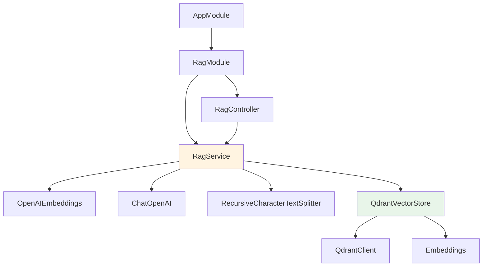

# 컴포넌트 상세 설명

## 목차

1. [프로젝트 구조](#프로젝트-구조)
2. [핵심 컴포넌트](#핵심-컴포넌트)
3. [의존성 관계](#의존성-관계)
4. [코드 예제](#코드-예제)

## 프로젝트 구조

```
rag-study/
├── src/
│   ├── main.ts                    # 애플리케이션 진입점
│   ├── app.module.ts              # 루트 모듈
│   ├── app.controller.ts          # 루트 컨트롤러
│   ├── app.service.ts             # 루트 서비스
│   └── rag/                       # RAG 모듈
│       ├── rag.module.ts          # RAG 모듈 정의
│       ├── rag.controller.ts      # RAG API 엔드포인트
│       ├── rag.service.ts         # RAG 비즈니스 로직
│       └── qdrant-vector-store.ts  # Qdrant VectorStore 구현
├── docs/                          # 문서
│   ├── ARCHITECTURE.md            # 아키텍처 문서
│   ├── API.md                     # API 문서
│   └── COMPONENTS.md              # 컴포넌트 문서 (본 문서)
├── uploads/                       # 업로드된 파일 저장소
└── dist/                          # 빌드 결과물
```

## 핵심 컴포넌트

### 1. RagModule (`rag.module.ts`)

**역할**: RAG 기능을 제공하는 NestJS 모듈

```typescript
@Module({
  providers: [RagService],
  controllers: [RagController]
})
export class RagModule {}
```

**특징:**
- `RagService`를 프로바이더로 등록
- `RagController`를 컨트롤러로 등록
- `AppModule`에서 import하여 사용

### 2. RagController (`rag.controller.ts`)

**역할**: HTTP 요청을 받아 서비스로 전달하는 컨트롤러

**주요 메서드:**

#### `addDocuments()`
- **경로**: `POST /rag/documents`
- **기능**: 텍스트 배열을 받아 문서 추가
- **요청**: `{ texts: string[] }`
- **응답**: `{ message: string }`

#### `uploadFile()`
- **경로**: `POST /rag/upload`
- **기능**: 파일 업로드로 문서 추가
- **요청**: `multipart/form-data` (file)
- **응답**: `{ message: string, filename: string }`
- **특징**: Multer를 사용한 파일 업로드 처리

#### `query()`
- **경로**: `POST /rag/query`
- **기능**: 질문에 대한 답변 생성
- **요청**: `{ question: string }`
- **응답**: `{ answer: string, sources: Array }`

#### `search()`
- **경로**: `GET /rag/search`
- **기능**: 유사 문서 검색
- **쿼리 파라미터**: `q` (검색어), `k` (개수, 선택)
- **응답**: `{ documents: Array }`

### 3. RagService (`rag.service.ts`)

**역할**: RAG 시스템의 핵심 비즈니스 로직 처리

**의존성:**
- `OpenAIEmbeddings`: 텍스트를 벡터로 변환
- `ChatOpenAI`: LLM을 통한 답변 생성
- `RecursiveCharacterTextSplitter`: 문서 분할
- `QdrantVectorStore`: 벡터 저장 및 검색

**생명주기:**
- `OnModuleInit` 구현: 모듈 초기화 시 벡터 스토어 초기화

**주요 메서드:**

#### `onModuleInit()`
- 모듈 초기화 시 호출
- 벡터 스토어 초기화 수행

#### `initializeVectorStore()`
- Qdrant 벡터 스토어 초기화
- 환경 변수에서 설정 읽기
- 컬렉션 이름 기본값: `rag-documents`

#### `addDocuments(texts: string[])`
```typescript
async addDocuments(texts: string[]): Promise<void>
```

**처리 과정:**
1. 텍스트를 `Document` 객체로 변환
2. `RecursiveCharacterTextSplitter`로 문서 분할
   - 청크 크기: 1000자
   - 오버랩: 200자
3. 벡터 스토어에 추가
   - 벡터 스토어가 없으면 새로 생성
   - 있으면 기존 스토어에 추가

#### `loadDocumentFromFile(filePath: string)`
```typescript
async loadDocumentFromFile(filePath: string): Promise<void>
```

**처리 과정:**
1. 파일 시스템에서 파일 읽기
2. `addDocuments()` 호출하여 처리

#### `query(question: string)`
```typescript
async query(question: string): Promise<{
  answer: string;
  sourceDocuments?: Document[];
}>
```

**처리 과정:**
1. 벡터 스토어에서 Retriever 생성 (상위 4개 문서)
2. 질문으로 관련 문서 검색
3. 검색된 문서를 컨텍스트로 결합
4. 프롬프트 템플릿 생성
5. LangChain 체인 실행:
   - `PromptTemplate` → `ChatOpenAI` → `StringOutputParser`
6. 답변과 소스 문서 반환

**프롬프트 템플릿:**
```
다음 컨텍스트를 사용하여 질문에 답변해주세요. 컨텍스트에 답이 없으면 모른다고 답변하세요.

컨텍스트:
{context}

질문: {question}

답변:
```

#### `similaritySearch(query: string, k: number)`
```typescript
async similaritySearch(query: string, k: number = 4): Promise<Document[]>
```

**처리 과정:**
1. 질문을 벡터로 변환
2. Qdrant에서 유사도 검색
3. 상위 K개 문서 반환

### 4. QdrantVectorStore (`qdrant-vector-store.ts`)

**역할**: LangChain의 `VectorStore` 인터페이스를 구현하여 Qdrant와 통합

**상속:**
- `VectorStore` (LangChain)

**의존성:**
- `QdrantClient`: Qdrant 서버와 통신
- `Embeddings`: 텍스트를 벡터로 변환

**주요 속성:**
- `client`: QdrantClient 인스턴스
- `collectionName`: 컬렉션 이름
- `vectorSize`: 벡터 차원 (기본값: 1536)

**주요 메서드:**

#### `constructor(embeddings, config)`
- Qdrant 클라이언트 초기화
- 환경 변수에서 URL 및 API 키 읽기
- 기본 URL: `http://localhost:6333`

#### `addDocuments(documents: Document[])`
```typescript
async addDocuments(documents: Document[]): Promise<string[]>
```

**처리 과정:**
1. 문서 텍스트 추출
2. 임베딩 모델로 벡터 변환
3. 컬렉션 존재 확인 및 생성 (`ensureCollection()`)
4. 벡터 포인트 생성 (ID, 벡터, 페이로드)
5. Qdrant에 업로드 (`upsert`)
6. 생성된 ID 배열 반환

#### `addVectors(vectors, documents)`
```typescript
async addVectors(vectors: number[][], documents: Document[]): Promise<string[]>
```

- 벡터를 직접 추가하는 메서드
- 임베딩 단계를 건너뛰고 벡터만 저장

#### `similaritySearch(query, k)`
```typescript
async similaritySearch(query: string, k: number = 4): Promise<Document[]>
```

**처리 과정:**
1. 질문을 벡터로 변환
2. `similaritySearchWithScore()` 호출
3. 점수 제거하고 문서만 반환

#### `similaritySearchWithScore(query, k)`
```typescript
async similaritySearchWithScore(
  query: string,
  k: number = 4
): Promise<[Document, number][]>
```

**처리 과정:**
1. 질문을 벡터로 변환
2. Qdrant `search()` 호출
   - `limit`: k
   - `with_payload`: true
3. 결과를 `Document` 객체로 변환
4. 문서와 점수 쌍 배열 반환

#### `ensureCollection()`
```typescript
private async ensureCollection(): Promise<void>
```

**처리 과정:**
1. 기존 컬렉션 목록 조회
2. 컬렉션이 없으면 생성
   - 벡터 크기: `vectorSize` (기본 1536)
   - 거리 측정: Cosine Similarity

#### `fromDocuments()` (정적 메서드)
```typescript
static async fromDocuments(
  documents: Document[],
  embeddings: Embeddings,
  config: QdrantVectorStoreConfig
): Promise<QdrantVectorStore>
```

- 문서로부터 VectorStore 인스턴스를 생성하는 편의 메서드
- 인스턴스 생성 후 문서 추가까지 수행

## 의존성 관계



## 코드 예제

### 문서 추가 예제

```typescript
// RagService 내부
const documents = texts.map(
  (text) => new Document({
    pageContent: text,
    metadata: {},
  })
);

const textSplitter = new RecursiveCharacterTextSplitter({
  chunkSize: 1000,
  chunkOverlap: 200,
});

const splitDocs = await textSplitter.splitDocuments(documents);
await this.vectorStore.addDocuments(splitDocs);
```

### 질의응답 예제

```typescript
// RagService 내부
const retriever = this.vectorStore.asRetriever(4);
const relevantDocs = await retriever.invoke(question);

const context = relevantDocs.map((doc) => doc.pageContent).join('\n\n');

const promptTemplate = PromptTemplate.fromTemplate(
  `다음 컨텍스트를 사용하여 질문에 답변해주세요...
컨텍스트: {context}
질문: {question}
답변:`
);

const chain = RunnableSequence.from([
  promptTemplate,
  this.llm,
  new StringOutputParser(),
]);

const answer = await chain.invoke({ context, question });
```

### 벡터 스토어 사용 예제

```typescript
// QdrantVectorStore 내부
const embeddings = await this.embeddings.embedDocuments(texts);

const points = documents.map((doc, index) => ({
  id: `${Date.now()}-${index}`,
  vector: embeddings[index],
  payload: {
    pageContent: doc.pageContent,
    metadata: doc.metadata,
  },
}));

await this.client.upsert(this.collectionName, {
  wait: true,
  points,
});
```

## 환경 변수

| 변수명 | 필수 | 기본값 | 설명 |
|--------|------|--------|------|
| `OPENAI_API_KEY` | 예 | - | OpenAI API 키 |
| `QDRANT_URL` | 아니오 | `http://localhost:6333` | Qdrant 서버 URL |
| `QDRANT_API_KEY` | 아니오 | - | Qdrant API 키 (Cloud 사용 시) |
| `QDRANT_COLLECTION_NAME` | 아니오 | `rag-documents` | 컬렉션 이름 |
| `PORT` | 아니오 | `3000` | 서버 포트 |

## 확장 포인트

### 1. 커스텀 텍스트 분할기

```typescript
// 다른 분할 전략 사용
const textSplitter = new TokenTextSplitter({
  encodingName: 'cl100k_base',
  chunkSize: 1000,
  chunkOverlap: 200,
});
```

### 2. 다른 임베딩 모델 사용

```typescript
// 다른 임베딩 모델 사용
import { HuggingFaceTransformersEmbeddings } from '@langchain/community/embeddings/hf_transformers';

this.embeddings = new HuggingFaceTransformersEmbeddings({
  modelName: 'sentence-transformers/all-MiniLM-L6-v2',
});
```

### 3. 다른 LLM 사용

```typescript
// 다른 LLM 모델 사용
import { ChatAnthropic } from '@langchain/anthropic';

this.llm = new ChatAnthropic({
  modelName: 'claude-3-opus',
  temperature: 0,
});
```

### 4. 메타데이터 필터링

```typescript
// QdrantVectorStore 확장
async similaritySearchWithFilter(
  query: string,
  k: number,
  filter: any
): Promise<Document[]> {
  const queryEmbedding = await this.embeddings.embedQuery(query);
  
  const searchResult = await this.client.search(this.collectionName, {
    vector: queryEmbedding,
    limit: k,
    filter: filter, // 필터 추가
    with_payload: true,
  });
  
  // 결과 변환...
}
```

## 테스트 전략

### 단위 테스트

- 각 컴포넌트의 메서드별 테스트
- Mock 객체를 사용한 의존성 격리

### 통합 테스트

- 실제 Qdrant 서버와의 통합 테스트
- E2E 테스트 시나리오

### 성능 테스트

- 대량 문서 추가 성능
- 검색 응답 시간 측정
- 동시 요청 처리 능력

